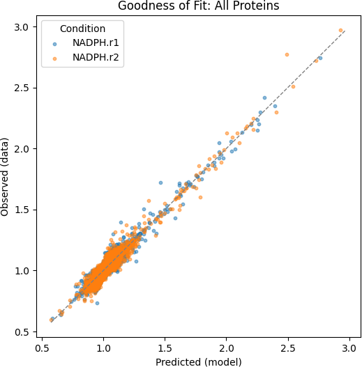

# Curve Fitting

The first stage of the pipeline converts raw CETSA dose–response measurements into quantitative biophysical parameters.

## Model

Each protein is modeled using a 4-parameter logistic function:

- Baseline response (E0)
- Maximum response (Emax)
- EC50 (half-maximal concentration)
- Hill coefficient (cooperativity)

This captures the characteristic sigmoidal response of protein stability under ligand perturbation.

## Key implementation details

- Fitting is performed in **log-dose space** for numerical stability.
- **Monotonic smoothing** is applied using isotonic regression to reduce noise.
- Parameter bounds are enforced to avoid unrealistic solutions.
- A mild **Hill regularization** is used to prevent extreme cooperativity.

!!! note "Why log-dose space?"
    NADPH concentrations span several orders of magnitude. Fitting in log space
    ensures equal weighting across the dynamic range and improves numerical stability
    of the optimizer.

## Quality control

Fits are discarded if they fail basic biological or statistical criteria:

- Low variance in signal
- Poor fit quality (low R²)
- Insufficient effect size (Δmax)

## Output

For each protein (and condition), the model returns:

- EC50 and logEC50
- Hill coefficient
- R² (goodness of fit)
- Δmax (effect size)

/// caption
Figure 1: Global goodness-of-fit distribution (R²) across all fitted proteins, indicating the overall quality of the 4PL model.
///

## Interpretation

- Low EC50 indicates high sensitivity to NADPH.
- High Δmax reflects strong stabilization or destabilization.
- R² provides confidence in the estimated parameters.

This stage transforms raw experimental data into interpretable biochemical quantities.