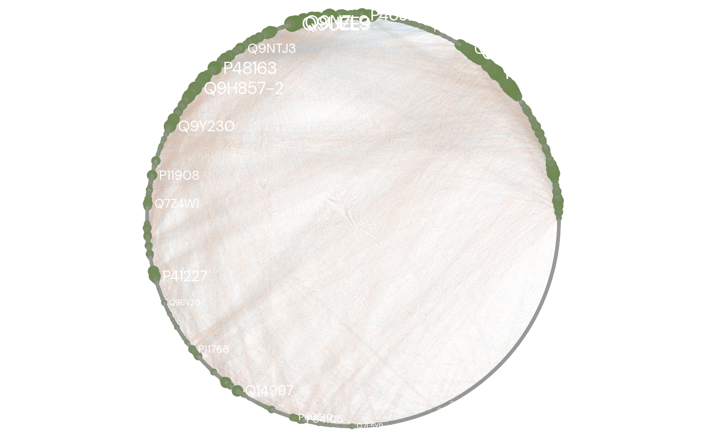

# Network Analysis

CETSA responses are not independent. Proteins often show coordinated stability changes due to shared pathways or
complexes.

## Co-stabilization network

The pipeline constructs a network where:

- Nodes represent proteins
- Edges represent correlation of dose–response profiles

## Steps

- Compute correlation matrix across proteins
- Apply threshold to define edges
- Build graph representation
- Detect modules using community detection

## Modules

Modules represent groups of proteins with similar response patterns.

These often correspond to:

- protein complexes
- metabolic pathways
- co-regulated systems

## Interpretation

- Dense modules suggest coordinated biological processes
- Edge weights reflect similarity in response behavior
- Network structure reveals system-level organization

This layer converts CETSA data into a functional interaction landscape.

/// caption
Figure 1: Co-stabilization network of NADPH-responsive proteins. Node colour reflects module membership; edge thickness represents correlation strength.
///