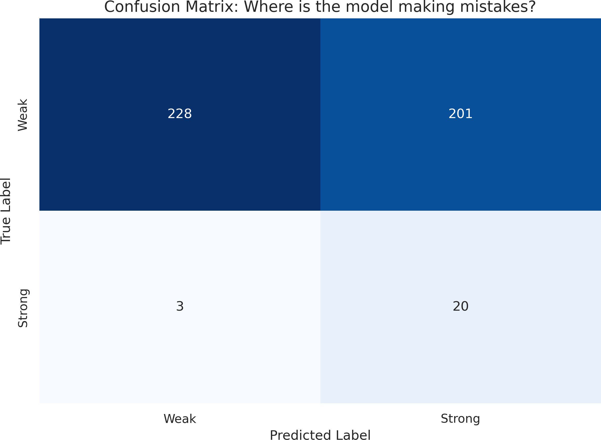
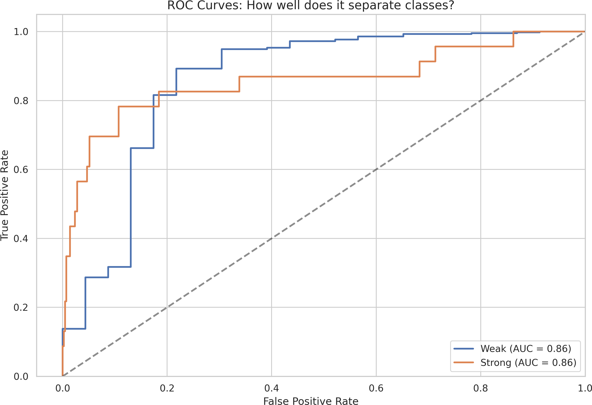
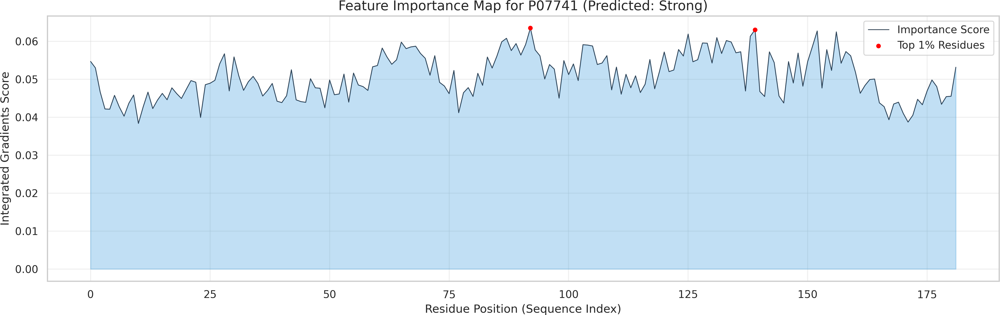
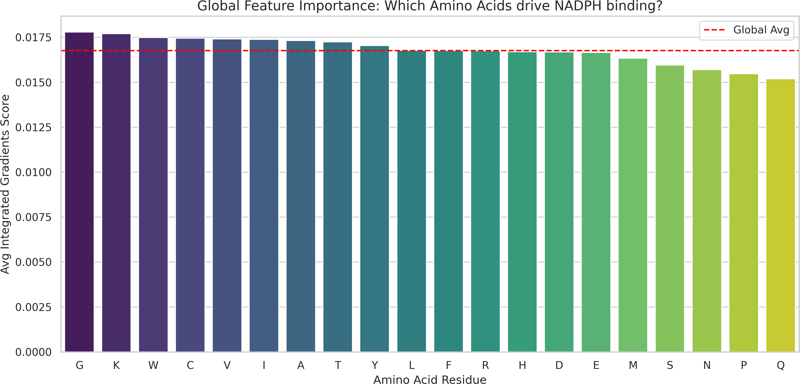

# Visualization

The pipeline includes structured visualization for both model evaluation and biological interpretation.

## Model evaluation

- Confusion matrix
- ROC curves
- Probability distributions

/// caption
Figure 1: Confusion matrix showing the classification performance of the sequence model on the held-out set.
///

/// caption
Figure 2: Receiver Operating Characteristic (ROC) curves for each class, illustrating model discrimination ability.
///

## Biological validation

- Prediction vs EC50 correlation
- Prediction vs Δmax or R²

## Interpretability

- Saliency maps
- Integrated gradients plots
- Residue importance summaries

/// caption
Figure 3: Saliency map highlighting residues whose sequence context most strongly influences NADPH responsiveness predictions.
///

/// caption
Figure 4: Per-residue importance scores aggregated across the test set, enabling identification of conserved functional motifs.
///

## Error analysis

- High-confidence misclassifications
- Identification of difficult cases

## Interpretation

These plots are designed to answer:

- Is the model accurate?
- Does it align with biology?
- Where does it fail?

Visualization is not decorative; it is diagnostic and interpretive.