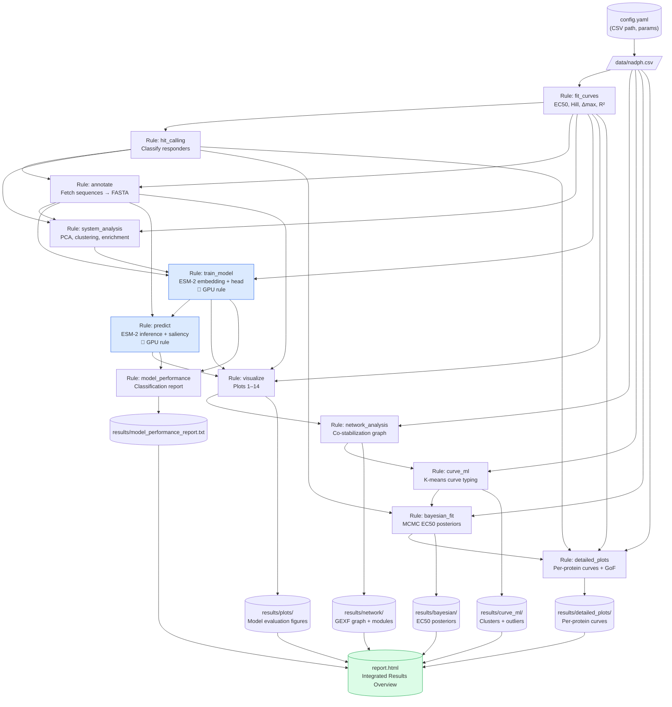

# Pipeline Overview

CETSAx is orchestrated entirely by Snakemake. The diagram below shows the complete
dependency graph — from raw CSV input to final outputs — as defined in the `Snakefile`.

## Pipeline Flow Diagram

The following diagram shows the complete orchestration of the `cetsax` pipeline,
from raw CSV input to final outputs, as managed by Snakemake.



!!! note "Running the pipeline"
    Run locally:
    ```bash
    snakemake --profile workflow/profiles/local
    ```
    Run on SLURM HPC:
    ```bash
    snakemake --profile workflow/profiles/slurm
    ```

!!! tip "report.html"
    After a complete run, `report.html` at the project root provides a self-contained
    interactive overview of all pipeline outputs — the recommended starting point for
    inspection.

## Rule Summary

| Rule | Inputs | Key Outputs | Resources |
|------|--------|-------------|-----------|
| `fit_curves` | `data/nadph.csv` | `ec50_fits.csv` | CPU |
| `hit_calling` | `ec50_fits.csv` | `cetsa_hits_ranked.csv` | CPU |
| `annotate` | fits + hits | `protein_sequences.fasta` | CPU |
| `system_analysis` | fits + hits + annotations | PCA, clustering, enrichment CSVs | CPU |
| `train_model` | fits + FASTA + cluster labels | `nadph_seq_head.pt`, embedding cache | **GPU** |
| `predict` | FASTA + checkpoint | `predictions_nadph_seq.csv` + saliency | **GPU** |
| `visualize` | predictions + fits + history | 14 evaluation plots | CPU |
| `network_analysis` | raw CSV | `network_graph.gexf`, modules | CPU |
| `curve_ml` | raw CSV | curve clusters + outliers | CPU |
| `bayesian_fit` | raw CSV + hits | Bayesian EC50 posteriors | CPU |
| `detailed_plots` | raw CSV + fits + hits | per-protein curves + GoF plot | CPU |
| `model_performance` | supervised + predictions | `model_performance_report.txt` | CPU |
